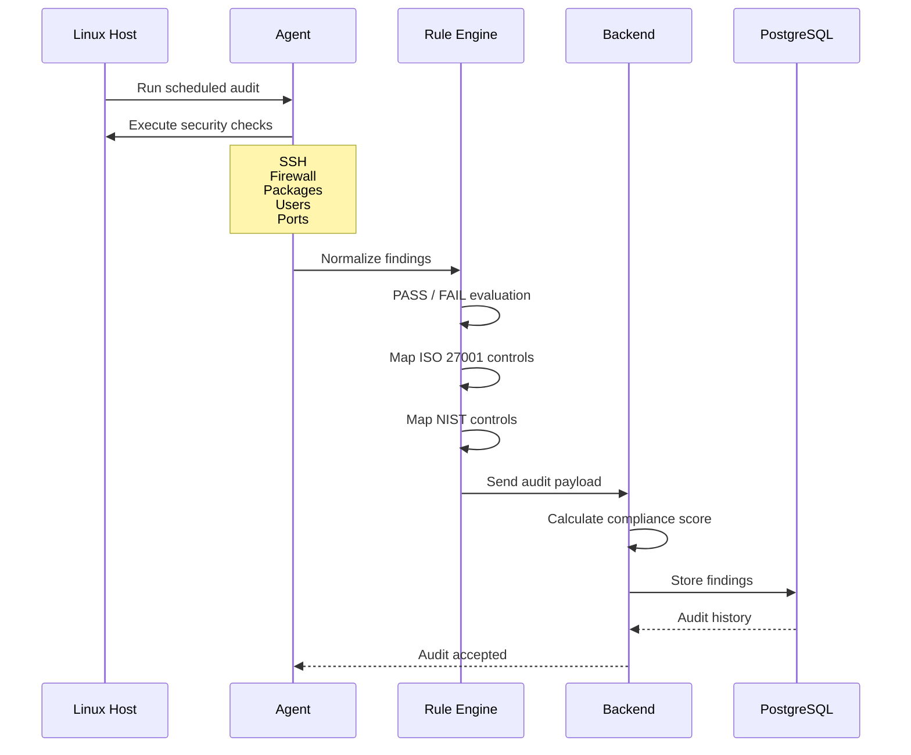

# SentinelOps

Agent-based infrastructure security platform for Linux security, compliance scoring, and future AI remediation.

## MVP scope

This first version intentionally builds only:

- Linux agent
- Backend ingest/scoring logic
- PostgreSQL schema
- ISO 27001 and NIST mapping for every security result

Dashboard, AI remediation, multi-cloud, SSO, Kubernetes, and multi-tenancy are future phases.

## Why Python for this scaffold

Go or Rust would be strong long-term choices for a production-grade OS agent, but they are not installed on this machine right now. Python is available, works well for Linux command execution and parsing, and lets us build/test the platform contract immediately.

The agent/backend boundaries are kept explicit so the agent can later be replaced by a compiled Go/Rust binary without changing the API payload.

## Architecture

```text
Linux Host
  |
  v
Sentinel Agent
  - collectors run OS commands
  - checks normalize evidence
  - rules evaluate PASS/FAIL
  - transport sends audit payload
  |
  v
Backend API
  - registers hosts
  - receives audits
  - calculates score
  - persists findings
  |
  v
PostgreSQL
```

## Audit workflow



## Project layout

```text
agent/
  sentinelops_agent/
    checks/
    collectors/
    rules/
    transport/
backend/
  sentinelops_backend/
    services/
    database/
tests/
```

## Compliance model

Each check result includes compliance mappings:

- ISO 27001 control IDs
- NIST SP 800-53 control IDs

This means both passing and failing checks can be reported against recognized security frameworks.

## Run tests

```powershell
cd C:\coding\sentinelops
python -m unittest discover -s tests
```

## How to run

### 1. Open the project

```powershell
cd C:\coding\sentinelops
```

### 2. Run the test suite

```powershell
python -m unittest discover -s tests
```

### 3. Start the backend API

```powershell
python -m backend.sentinelops_backend.app
```

The backend starts at:

```text
http://127.0.0.1:8080
```

Audit ingestion endpoint:

```text
POST http://127.0.0.1:8080/api/audits
```

### 4. Run the agent

```powershell
python -m agent.sentinelops_agent.index
```

The agent prints an audit payload as JSON. On a real Ubuntu/Linux host, it runs checks such as:

- SSH configuration
- UFW firewall status
- Pending security updates
- Admin accounts
- Listening ports
- `/etc/shadow` permissions

### Platform note

The agent is designed for Linux. It can be executed on Windows for development, but Linux-specific commands such as `ufw`, `ss`, and `stat /etc/shadow` will not return real security evidence on Windows.
