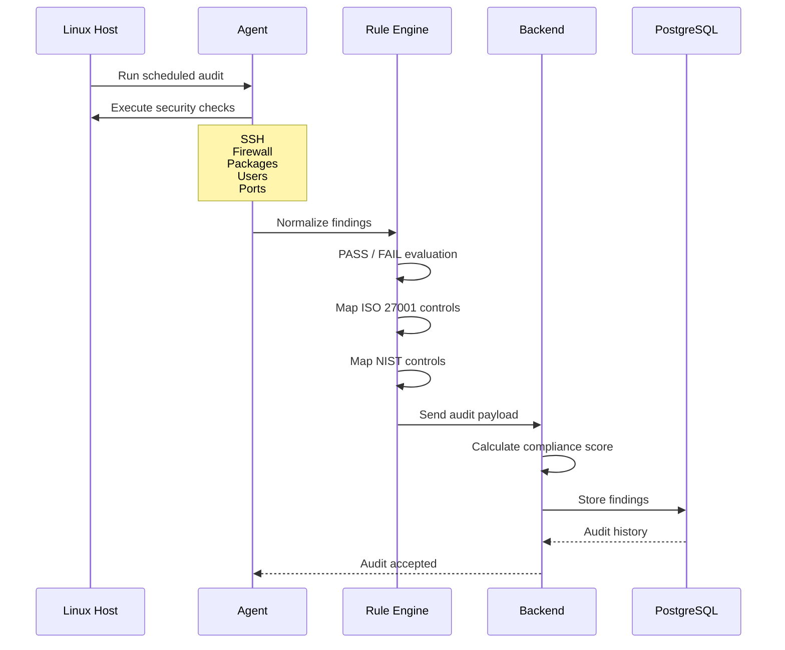

# SentinelOps

Agent-based infrastructure security platform for Linux security, compliance scoring, and future AI remediation.

## MVP scope

This first version intentionally builds only:

- Linux agent
- Backend ingest/scoring logic
- PostgreSQL schema
- ISO 27001 and NIST mapping for every security result

Dashboard, AI remediation, multi-cloud, SSO, Kubernetes, and multi-tenancy are future phases.

## Why Python for this scaffold

Go or Rust would be strong long-term choices for a production-grade OS agent, but they are not installed on this machine right now. Python is available, works well for Linux command execution and parsing, and lets us build/test the platform contract immediately.

The agent/backend boundaries are kept explicit so the agent can later be replaced by a compiled Go/Rust binary without changing the API payload.

## Architecture

```text
Linux Host
  |
  v
Sentinel Agent
  - collectors run OS commands
  - checks normalize evidence
  - rules evaluate PASS/FAIL
  - transport sends audit payload
  |
  v
Backend API
  - registers hosts
  - receives audits
  - calculates score
  - persists findings
  |
  v
PostgreSQL
```

## Audit workflow



## Project layout

```text
agent/
  sentinelops_agent/
    checks/
    collectors/
    rules/
    transport/
backend/
  sentinelops_backend/
    services/
    database/
tests/
```

## Compliance model

Each check result includes compliance mappings:

- ISO 27001 control IDs
- NIST SP 800-53 control IDs

This means both passing and failing checks can be reported against recognized security frameworks.

## Run tests

```powershell
cd C:\coding\sentinelops
python -m unittest discover -s tests
```
